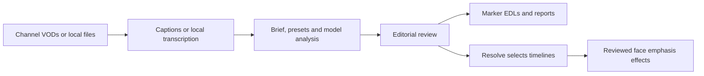

# VISAMEDIA

### From hours of livestream footage to editable selections in DaVinci Resolve.

VISAMEDIA is a personal desktop companion for finding conversations, reactions and highlight candidates in long livestreams. It combines a keyboard-driven terminal interface, configurable AI analysis and an editing workflow that keeps clips linked to their original source footage.

**Public project showcase · Active development · Application source code is private**

## The problem

A useful moment in a livestream can be a thirty-second reaction or a complete ten-minute discussion. Finding it manually means searching through hours of footage, keeping track of timestamps and rebuilding the same editing setup for each stream.

VISAMEDIA lets the editor describe the kind of video they want, browse recent streams, reuse a channel's preferences and turn candidate moments into markers or editable timeline selections.

## The workflow

1. **Choose footage.** Browse Twitch, Kick or YouTube channel history, select multiple VODs, paste URLs or reference local video files.
2. **Describe the edit.** Combine long-form and Shorts presets, write a narrative brief, and adjust duration, exclusions and quality thresholds.
3. **Analyze and review.** Use a selected AI provider, optionally compare two selectors and inspect a verdict with supporting transcript evidence.
4. **Open in Resolve.** Export marker EDLs or assemble selected source ranges back-to-back, with markers and access to the original media handles.
5. **Refine without starting over.** Try another prompt or model against the saved transcript and compare independent result versions.

## Selected capabilities

| Area | What it enables |
| --- | --- |
| VOD browsing | Saved channels, paginated history, title filters and group selection with Space |
| Reusable profiles | Channel-specific briefs, content styles, filters, model choices and clip-guide notes |
| Narrative discovery | Complete conversations, evolving opinions across source streams, standalone reactions and Shorts candidates |
| Model flexibility | Codex/ChatGPT subscription integration, a Claude Code subscription adapter, and local Ollama analysis |
| Editorial review | Two independent candidate sets followed by a verdict; uncertain interpretations remain visible for review |
| Experiment versions | Reuse transcripts and existing media, compare selections and save successful prompts as presets |
| Resolve handoff | Original-media selections, mapped markers, separate Videos/Shorts timelines and optional project opening |
| Thumbnail candidates | Sampled face-location and expression analysis, local image-quality screening and manual approval |
| Editable effects | Reviewed face zoom suggestions, local motion tracking, Fusion keyframes and separate Effects timeline versions |
| Format-specific layouts | Independent Videos and Shorts native layout snapshots and channel preferences |

## Interface

A compact, centered workspace with a shimmering wordmark, keyboard navigation and platform colors: purple for Twitch, green for Kick and red for YouTube. Navigation, terminal resizing and progress display have been refined through repeated use.

*Development screenshots from the working application. Labels and navigation continue to evolve. Channel names and stream titles are examples of browsing public metadata; they do not imply affiliation.*

## Engineering focus

- **Preserve editability:** place source In/Out ranges on the timeline rather than baking selected clips into replacement files.
- **Keep experiments reproducible:** save transcript snapshots, source references, per-run outputs and model decisions.
- **Make failures explicit:** stop on invalid model output or failed review, retain partial records, and flag uncertain candidates.
- **Keep the editor in control:** distinguish a proposed title or reaction from an approved editing decision.
- **Separate responsibilities:** UI, media processing, provider adapters, analysis and Resolve integration have distinct roles.

Technology: **Python, prompt_toolkit, Rich, yt-dlp, FFmpeg/FFprobe, faster-whisper, Ollama, OpenCV, Pillow, and the DaVinci Resolve scripting/Fusion APIs.**

See the [development case study](CASE_STUDY.md) for design decisions, validation and current limits.

## Current status

This is a working personal tool under active development, with automated checks and local integration trials. Resolve selection placement and the first editable zoom pass have been exercised; zoom rendering was validated with synthetic moving footage. The Claude subscription adapter has automated coverage but still needs a live session trial. Real-stream face selection and tracking quality need further evaluation.

**Separate Videos/Shorts layout snapshots are implemented. Automatically applying arbitrary three-layer templates to new selections is still pending mapping and validation.** Shorts selection does not itself produce a finished vertical edit. Transcript-based analysis cannot reliably infer vocal tone, silent visual highlights or sarcasm, and suggested clips require editorial review.

## About this repository

This repository presents the product and its development for portfolio/CV use. It contains documentation and selected interface screenshots. The application, private source code, credentials, media library, transcripts and run logs are not distributed here. There is no downloadable application release in this repository.

The project is developed iteratively with AI-assisted coding and hands-on workflow design. VISAMEDIA is independent of the platforms, AI providers and editing products mentioned above.

**Owner:** [visavv](https://github.com/visavv)
